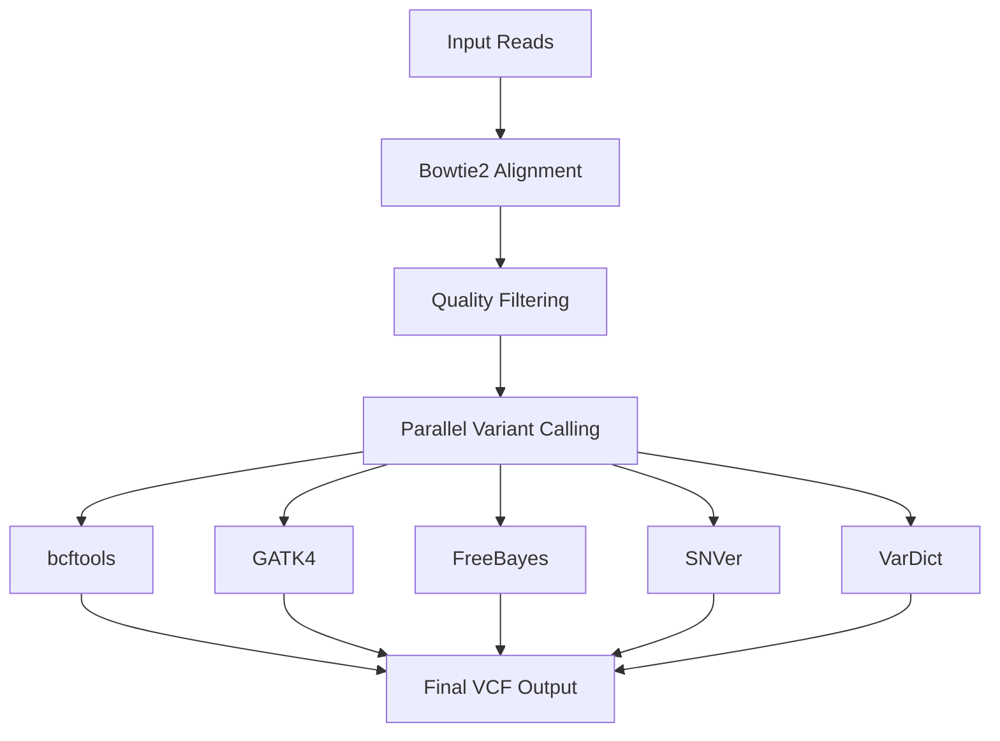

# ChoCallate 🍫

**ChoCallate** (**Cho**rus of **Call**ers) is a high-performance, automated pipeline for consensus-based variant calling that combines multiple variant callers to produce robust, high-confidence single-nucleotide variants (SNVs) and indels (INDELs).

## 🎯 What is ChoCallate?

ChoCallate addresses a critical challenge in variant calling: individual variant callers can produce different results for the same genomic data, leading to uncertainty in variant identification. By implementing a **consensus-driven approach**, ChoCallate combines results from multiple state-of-the-art variant callers and applies configurable consensus rules to generate reliable, high-quality variant calls.

### 🌟 Key Features

- **🔄 Consensus-driven approach**: Combines multiple variant callers using configurable consensus rules
- **🧬 Ploidy flexibility**: Supports both diploid and polyploid species with automatic caller selection
- **📊 Multiple consensus types**: Majority rule, n-1 consensus, and full consensus options
- **🔧 Flexible input support**: Compatible with GBS (Genotyping-by-Sequencing) and WGS data
- **⚡ Parallel processing**: Efficient parallel execution for optimal performance
- **🎛️ Configurable quality filtering**: Multiple filtering steps based on coverage, base quality, and SNP quality
- **📈 Comprehensive logging**: Detailed execution tracking and performance monitoring

## 🚀 Quick Start

### 1. Installation

```bash
# Clone the repository
git clone https://github.com/alermol/ChoCallate.git
cd ChoCallate

# Set up the Conda environment
conda env create -f environment.yaml
conda activate ChoCallate
```

### 2. Test Run

```bash
# Run the pipeline on test data
bash run_test.sh

# Optional: Clean up test output
bash cleanup.sh
```

### 3. Basic Usage

```bash
nextflow run main.nf \
    --reference_genome /path/to/reference.fasta \
    --reference_index /path/to/reference_index \
    --samples_tsv samples.tsv
```

## 🏗️ Pipeline Architecture

### Supported Variant Callers

| Caller | Diploid Support | Polyploid Support | Description |
|--------|----------------|-------------------|-------------|
| **bcftools** | ✅ | ❌ | Fast, lightweight variant calling |
| **GATK4** | ✅ | ✅ | Industry-standard variant calling |
| **FreeBayes** | ✅ | ✅ | Bayesian variant detection |
| **SNVer** | ✅ | ✅ | Statistical variant calling |
| **VarDict** | ✅ | ❌ | Advanced variant detection |

### Workflow Steps



1. **🔍 Alignment**: Bowtie2-based read alignment with quality filtering
2. **📊 Variant Calling**: Parallel execution of selected variant callers
3. **🤝 Consensus Generation**: Merges results using configurable consensus rules
4. **📤 Output**: Final compressed VCF files for SNPs and INDELs

## ⚙️ Configuration

### Essential Parameters

| Parameter | Required | Default | Description |
|-----------|----------|---------|-------------|
| `--reference_genome` | ✅ | - | Reference genome in FASTA format (must not be gzipped) |
| `--reference_index` | ✅ | - | Bowtie2 index prefix for the reference genome |
| `--samples_tsv` | ✅ | `samples.tsv` | TSV file with sample information |

### Input/Output Parameters

| Parameter | Default | Description |
|-----------|---------|-------------|
| `--outdir` | `ChoCallate_output` | Output directory for results |


### Quality and Filtering Parameters

| Parameter | Default | Description |
|-----------|---------|-------------|
| `--min_coverage` | `5` | Minimum position coverage depth for variant calling |
| `--min_base_quality` | `20` | Minimum base quality for variant calling |
| `--min_map_qual` | `10` | Minimum mapping quality for read filtering |
| `--min_snp_qual` | `20` | Minimum variant quality threshold |

### Data Type Parameters

| Parameter | Default | Choices | Description |
|-----------|---------|---------|-------------|
| `--reads_type` | `pe` | `pe`, `se`, `mx` | Read type: paired-end, single-end, or mixed |
| `--reads_source` | `gbs` | `gbs`, `wgs` | Data source: GBS or whole genome sequencing |
| `--ploidy` | `2` | `≥2` | Ploidy level of the organism |

### Variant Calling Parameters

| Parameter | Default | Description |
|-----------|---------|-------------|
| `--effective_callers` | `-` | Comma-separated list of variant callers to use. Use `-` for automatic selection based on ploidy |
| `--cons_type` | `mj` | Consensus type: `mj` (majority), `n1` (n-1), `fc` (full consensus) |

### Resource Allocation Parameters

| Parameter | Default | Description |
|-----------|---------|-------------|
| `--bowtie2_cpu` | `10` | Number of threads for Bowtie2 alignment |
| `--bowtie2_forks` | `1` | Number of parallel Bowtie2 processes |
| `--calling_forks` | `1` | Number of parallel variant calling processes |
| `--zero_vcf_cpu` | `1` | Number of threads for zero VCF generation |
| `--zero_vcf_forks` | `1` | Number of parallel zero VCF processes |
| `--cons_cpus` | `5` | Number of threads for consensus generation |
| `--cons_forks` | `1` | Number of parallel consensus processes |
| `--bcftools_cpu` | `1` | Number of threads for bcftools |
| `--vardict_cpu` | `1` | Number of threads for VarDict |

### Processing Parameters

| Parameter | Default | Description |
|-----------|---------|-------------|
| `--win_size` | `1000000` | Window size (in bp) for parallel consensus generation |
| `--debug` | `false` | Keep working directory after pipeline completion |

### Cleanup Configuration Parameters

| Parameter | Default | Description |
|-----------|---------|-------------|
| `--enable_sample_cleanup` | `true` | Enable/disable sample-specific cleanup (false in debug mode) |
| `--cleanup_intermediate_bam` | `true` | Remove intermediate BAM files (false in debug mode) |
| `--cleanup_intermediate_vcf` | `true` | Remove intermediate VCF files (false in debug mode) |
| `--cleanup_intermediate_subfolders` | `true` | Remove intermediate subfolders (false in debug mode) |
| `--cleanup_input_symlinks` | `true` | Remove symlinks to input files (false in debug mode) |

### Logging Parameters

| Parameter | Default | Choices | Description |
|-----------|---------|---------|-------------|
| `--log_level` | `INFO` | `DEBUG`, `INFO`, `WARN`, `ERROR`, `FATAL` | Logging level for pipeline execution |
| `--log_format` | `json` | `json`, `text`, `both` | Log output format |
| `--log_timestamp` | `true` | `true`, `false` | Include timestamps in logs |
| `--log_process` | `true` | `true`, `false` | Include process names in logs |
| `--log_sample` | `true` | `true`, `false` | Include sample IDs in logs |
| `--log_file` | `ChoCallate.log` | - | Main log file path |
| `--log_error_file` | `ChoCallate_errors.log` | - | Error log file path |

### Consensus Types

- **`mj` (Majority Rule)**: Variant is called if majority of callers identify it
- **`n1` (N-1 Consensus)**: Variant is called if n-1 callers identify it (where n is total number of callers)
- **`fc` (Full Consensus)**: Variant is called only if all callers identify it


### Automatic Caller Selection

When `--effective_callers` is set to `-` (default), ChoCallate automatically selects appropriate callers among available:
- **Diploid (ploidy=2)**: Uses `bcftools,gatk,freebayes,snver,vardict`
- **Polyploid (ploidy>2)**: Uses `gatk,freebayes,snver` (polyploid-compatible callers only)

### Ploidy and Caller Selection Examples

```bash
# Diploid species (default)
nextflow run main.nf \
    --ploidy 2 \
    --cons_type mj

# Polyploid species
nextflow run main.nf \
    --ploidy 4 \
    --cons_type n1 \
    --effective_callers gatk,freebayes,snver
```

## 📁 Input Data Structure

### Samples TSV Format

Create a tab-separated file with sample information:

```bash
# samples.tsv
sample1    /path/to/sample1_R1.fq.gz    /path/to/sample1_R2.fq.gz    /path/to/sample1_SE.fq.gz
sample2    /path/to/sample2_R1.fq.gz    /path/to/sample2_R2.fq.gz    /path/to/sample2_SE.fq.gz
```

**Read Type Configurations**:
- **`--reads_type pe`**: Paired-end reads (columns 2 & 3)
- **`--reads_type se`**: Single-end reads (column 2)
- **`--reads_type mx`**: Mixed reads (columns 2 & 3 for PE, column 4 for SE)

### Reference Requirements

- **Format**: Uncompressed FASTA
- **Index**: Pre-built Bowtie2 index
- **Path**: Absolute paths recommended

## 📊 Output Structure

```
ChoCallate_output/
├── sample1/
│   ├── sample1.snps.vcf.gz      # Final SNPs VCF (bgzipped)
│   └── sample1.indels.vcf.gz    # Final INDELs VCF (bgzipped)
├── sample2/
│   ├── sample2.snps.vcf.gz
│   └── sample2.indels.vcf.gz
├── ChoCallate_error.log          # Error log for the entire pipeline
├── ChoCallate.log                # Main log file for the pipeline
├── pipeline_report.html          # Pipeline summary report (HTML)
├── timeline_report.html          # Timeline of process execution (HTML)
└── trace.txt                     # Detailed process trace file
```

## 🔧 Advanced Configuration

### Quality Filtering

```bash
nextflow run main.nf \
    --min_coverage 10 \
    --min_base_quality 30 \
    --min_map_qual 20 \
    --min_snp_qual 30
```

### Resource Allocation

```bash
nextflow run main.nf \
    --bowtie2_cpu 16 \
    --cons_cpus 8 \
    --win_size 2000000
```

### Memory Optimization

For large genomes or high read counts, adjust memory allocation:

```bash
# Replace N with desired RAM in GB
sed -i 's/-Xmx1g/-XmxNg/' $CONDA_PREFIX/bin/snver
sed -i 's/-Xmx8g/-XmxNg/' $CONDA_PREFIX/bin/vardict-java
```

## 🛠️ Dependencies

All dependencies are managed via Conda:

```yaml
# Core variant callers
- freebayes>=1.3.9
- gatk4=4.6.*
- snver=0.5.3
- vardict-java=1.8.3
- bcftools>=1.20

# Alignment and processing
- bowtie2
- samtools>=1.21
- bedtools
- bedops>=2.4.42

# Pipeline framework
- nextflow
- python
- tabix>=1.11
- parallel
```

## 📈 Performance and Optimization

### Parallel Processing

- **Parallel processing**: Efficient parallel execution of variant callers
- **Multi-threading**: Configurable CPU allocation per process
- **Fork-based parallelism**: Multiple parallel instances for I/O intensive tasks

### Memory Management

- **Streaming consensus**: Efficient memory usage for large datasets
- **Intermediate cleanup**: Automatic removal of temporary files
- **Memory optimization**: Efficient memory usage for large datasets

## 🐛 Troubleshooting

### Common Issues

1. **Memory errors**: Increase memory allocation for SNVer/VarDict
2. **Disk space**: Monitor available disk space for intermediate files
3. **Reference format**: Ensure FASTA is uncompressed
4. **Path issues**: Use absolute paths for input files

### Debug Mode

```bash
nextflow run main.nf \
    --debug \
    --log_level DEBUG
```

Debug mode preserves all intermediate files for analysis.


## 📄 Citation

**APA Style**:  
Ermolaev, A. (2025). *ChoCallate: Consensus variant calling pipeline* [Computer software]. GitHub. https://github.com/alermol/ChoCallate

**BibTeX**:  
```bibtex
@software{ChoCallate,
  author = {Ermolaev, A.},
  title = {ChoCallate: Consensus variant calling pipeline},
  url = {https://github.com/alermol/ChoCallate},
  year = {2025}
}
```

## 📜 License

MIT License - see [LICENSE](LICENSE) file for details.

---

**Need help?** Open an issue on GitHub or check our troubleshooting guide above.
