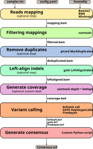

# ChoCallate 🍫


**ChoCallate** (**Cho**rus of **Call**ers) - a **Nextflow** pipeline for **consensus-based variant calling**. 

ChoCallate runs several variant callers and applies configurable consensus rules to produce high-confidence **SNVs** and **INDELs**. It addresses a critical challenge in variant calling: individual variant callers can produce different results for the same genomic data, leading to uncertainty in variant identification. By implementing a consensus-driven approach, ChoCallate combines results from multiple state-of-the-art variant callers and applies configurable consensus rules to generate reliable, high-quality variant calls.

<p align="center">
    
</p>

## Requirements

- **Linux** (tested). macOS/Windows are not currently tested.
- **Conda** (Miniconda/Anaconda) or **Mamba**
- **Git**
- **Nextflow**

## Installation

```bash
git clone --depth 1 https://github.com/alermol/ChoCallate.git
cd ChoCallate
conda env create -y -f environment.yaml
conda activate ChoCallate
```

Optional verification:

```bash
bash run_test.sh
```

## Usage

ChoCallate is configured primarily via a Nextflow params YAML file. Start from the template.

Minimum set of parameters in `my_run.yaml`:

- **`samples_tsv`**: input samples TSV (formats below)
- **`reference_genome`**: reference FASTA (plain or bgzip-compressed)
- **`reference_index_dir`**: path to directory with index files for reference genome

After configuration is complete you can run the ChoCallate

```bash
cp assets/templates/config.yaml my_run.yaml
nextflow run main.nf -params-file my_run.yaml
```

## Inputs

- **Reads**: FASTQs (`input_format: "fastq"`) or a pre-aligned BAM (`input_format: "bam"`). If you provide a BAM, mapping is skipped.
- **Reference genome**: Plain or bgzipped FASTA file.
- **Indexes of reference genome**: All indexes required by the selected mapper/callers.
- **Tip**: Use **absolute paths** for inputs.

`samples_tsv` formats:

- **FASTQ + paired-end** (`reads_type: "pe"`): `sample_id<TAB>R1<TAB>R2`
- **FASTQ + single-end** (`reads_type: "se"`): `sample_id<TAB>R1`
- **FASTQ + mixed** (`reads_type: "mx"`): `sample_id<TAB>R1<TAB>R2<TAB>U` (Bowtie2 mapping only)
- **BAM** (`input_format: "bam"`): `sample_id<TAB>bam_path`

## Outputs

Published outputs are written to `outdir` (default: `ChoCallate_output`), including standard Nextflow reports:

- `pipeline_report.html`
- `timeline_report.html`
- `trace.txt`

Consensus outputs depend on `output.type` and `output.format`:

- **Per-sample**: `<outdir>/per_sample/<sample_id>/consensus.bcf` (default) or `consensus.vcf.gz`
- **Single merged**: `<outdir>/consensus.bcf` or `<outdir>/consensus.vcf.gz`

## Additional documentation

- **Wiki home**: [ChoCallate Wiki](https://github.com/alermol/ChoCallate/wiki)
- **Install**: [Installing ChoCallate](https://github.com/alermol/ChoCallate/wiki/Installing-ChoCallate)
- **Quick start / config & CLI**: [CLI Reference](https://github.com/alermol/ChoCallate/wiki/CLI-Reference)
- **Outputs**: [Output Structure](https://github.com/alermol/ChoCallate/wiki/Output-Structure)

## Contribution

See [CONTRIBUTING.md](https://github.com/alermol/ChoCallate/blob/main/CONTRIBUTING.md)

## License

[MIT](https://github.com/alermol/ChoCallate/blob/main/LICENSE)


## Development roadmap

See [Development Roadmap](https://github.com/alermol/ChoCallate/wiki/Development-Roadmap) for planned container support and additional callers/mappers.